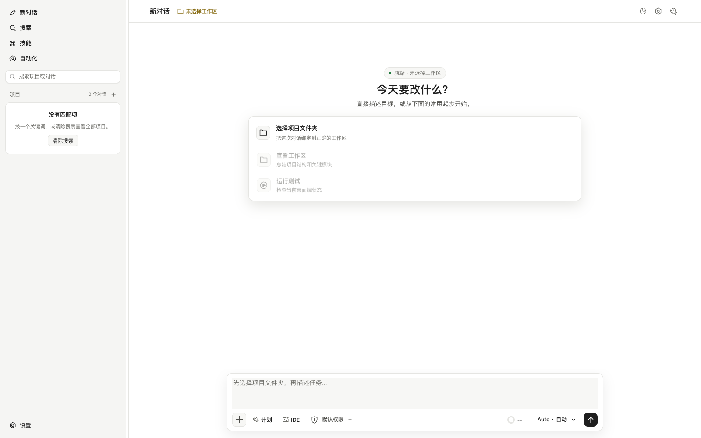

<p align="center">
  
</p>

<h1 align="center">Ore Code</h1>

<p align="center">
  <strong>面向 DeepSeek 和真实项目上下文的桌面端 AI 编码工作台。</strong>
</p>

<p align="center">
  长上下文编码、本地工具执行、代码变更审查、MCP 集成、技能、自动化，以及原生 macOS / Windows 安装包。
</p>

<p align="center">
  <a href="https://github.com/233i/ore-code/releases/latest"></a>
  <a href="./LICENSE"></a>
  
  
</p>

<p align="center">
  <a href="https://github.com/233i/ore-code/releases/download/v0.1.0/Ore.Code_0.1.0_aarch64.dmg"><strong>下载 macOS 版</strong></a>
  ·
  <a href="https://github.com/233i/ore-code/releases/download/v0.1.0/Ore.Code_0.1.0_x64-setup.exe"><strong>下载 Windows 版</strong></a>
  ·
  <a href="./docs/README.md">文档</a>
  ·
  <a href="./README.md">English</a>
</p>



## 这是什么

Ore Code 是一个围绕真实工作区上下文构建的桌面端编码 Agent。它由 TypeScript agent runtime、React/Tauri 桌面应用和 Rust OS boundary 组成，负责本地文件、shell、process、Git、keychain、artifact 和 MCP 操作。

它适合需要 Agent 读取真实项目、执行命令、保持长对话连续性，并清楚展示“改了什么、跑了什么、结果如何”的编码场景。

## 亮点

| 编码工作流 | 本地执行 | 上下文控制 |
| --- | --- | --- |
| 与项目感知 Agent 对话，查看 diff，撤销本轮任务变更，并持续看到任务状态。 | 通过原生桌面边界运行 file、shell、process、Git、test、web fetch、artifact 和 MCP 工具。 | 支持历史压缩、context briefing、checkpoint summary、用量可视化和 DeepSeek-compatible 请求组织。 |

| 配置 | 技能和 MCP | 发布目标 |
| --- | --- | --- |
| 在 `~/.ore-code/config.toml` 中配置 provider、model、base URL 和 thinking；API Key 只进入系统钥匙串。 | 添加可复用技能，连接 MCP server，并在项目 `.ore-code/` 中维护项目指令。 | 当前正式版提供 macOS Apple Silicon 和 Windows x64 安装包。 |

## 下载

最新版本：[Ore Code v0.1.0](https://github.com/233i/ore-code/releases/tag/v0.1.0)

| 平台 | 安装包 | SHA-256 |
| --- | --- | --- |
| macOS Apple Silicon | [`Ore.Code_0.1.0_aarch64.dmg`](https://github.com/233i/ore-code/releases/download/v0.1.0/Ore.Code_0.1.0_aarch64.dmg) | `b315d91a8aa3dbbc072f879687de201ecf380e33a83a5701911851c9d637ff15` |
| Windows x64 | [`Ore.Code_0.1.0_x64-setup.exe`](https://github.com/233i/ore-code/releases/download/v0.1.0/Ore.Code_0.1.0_x64-setup.exe) | `07c3ef5d07cfbf24ab90ef9baa71dc078e66adf6104032af608197e707aa2267` |

只安装本仓库 GitHub Releases 中发布的构建产物。

### macOS 安装提示

macOS 构建使用 ad-hoc 签名，尚未使用 Apple Developer ID 签名和公证。macOS 拦截应用时：

1. 按住 Control 点击或右键点击 `Ore Code.app`。
2. 选择**打开**。
3. 在确认弹窗里再次选择**打开**。
4. 如果仍然被拦截，打开**系统设置 > 隐私与安全性**，选择**仍要打开**。

### Windows 安装提示

早期构建可能触发 Windows SmartScreen 提醒。如果安装包来自官方 release 页面，可以选择**更多信息**，再选择**仍要运行**。

## 仓库结构

```text
apps/desktop/          Tauri 桌面应用
packages/protocol/     Runtime event schema 和共享协议类型
packages/tools/        工具定义、审批策略和工具辅助逻辑
packages/agent-core/   Agent engine、提示词、运行时上下文和模型适配
packages/state/        会话、事件和 artifact 存储辅助逻辑
packages/harness/      场景回放和 harness 测试
docs/                  产品、架构、工作流和项目规划文档
scripts/               本地辅助脚本
```

## 开发

环境要求：

- Node.js 20+；`.node-version` 中固定的开发和 CI 版本是 Node 22。
- pnpm 11.x。仓库在 `packageManager` 中声明了 `pnpm@11.0.8`。
- Rust stable 和 Cargo。
- 当前操作系统对应的 Tauri 2 系统依赖。
- Git。

启动桌面应用：

```bash
pnpm install
pnpm dev
```

运行本地检查：

```bash
pnpm ci:local
pnpm --filter @ore-code/desktop smoke
```

构建安装包：

```bash
pnpm --filter @ore-code/desktop tauri:build
pnpm build:desktop:windows
```

## 配置和本地数据

Ore Code 会在仓库外创建和读取用户级运行时数据：

- `~/.ore-code/config.toml`，用于 provider/model/base URL/thinking 配置
- `~/.ore-code/mcp.json`，用于用户级 MCP server
- `~/.ore-code/skills`，用于用户级 skills

项目内的 `.ore-code/` 运行时数据已被 Git 忽略。

## 文档

- [架构概览](./docs/ARCHITECTURE_OVERVIEW.md)
- [开发指南](./docs/DEVELOPMENT.md)
- [故障排查](./docs/TROUBLESHOOTING.md)
- [FAQ](./docs/FAQ.md)
- [本地数据和配置](./docs/LOCAL_DATA_AND_CONFIG.md)
- [包边界和兼容性](./docs/API_AND_COMPATIBILITY.md)
- [路线图](./docs/ROADMAP.md)
- [技能系统](./docs/06-skill-system.md)
- [DeepSeek V4 上下文策略](./docs/DEEPSEEK_V4_CONTEXT.md)
- [已知限制](./docs/KNOWN_LIMITATIONS.md)

## 项目

- [贡献指南](./CONTRIBUTING.md)
- [支持](./SUPPORT.md)
- [行为准则](./CODE_OF_CONDUCT.md)
- [隐私](./PRIVACY.md)
- [安全](./SECURITY.md)
- [更新日志](./CHANGELOG.md)

## 许可证

Ore Code 基于 [MIT License](./LICENSE) 发布。
